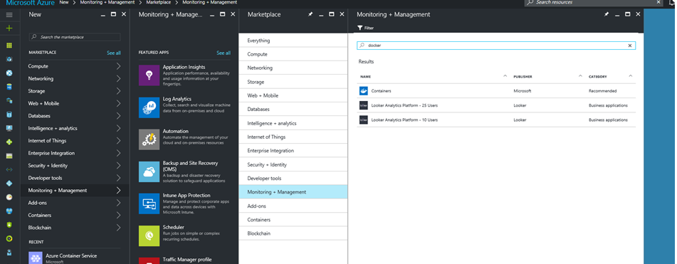
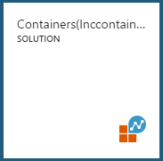
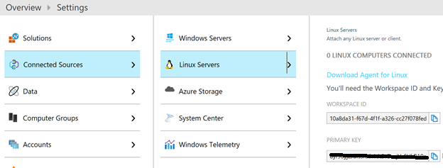
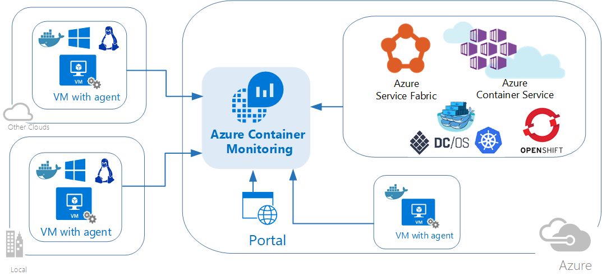

# Instrument & Monitor your containers
In this section, we are going to set up a container to integrate our Docker environment with Azure's Operations Management Suite.

## Task 1: Prepare OMS
1. Add Docker management solution
    1. Open the Azure portal in your browser
    2. In the New blade under Marketplace, select Monitoring + management.
    3. In the Monitoring + management blade, click See all and search for Docker<br>
    
    4. Click on **Containers Monitoring Solution** then click *Create*
    5. Click on _Select a workspace_ and then click **Create new workspace**
    6. Provide the details for the new workspace and click OK
    7. After the validation check “Pin to dashboard” and click **Create**

2. Retrieve the workspace id and primary key
    1. On the Azure portal dashboard click on your Containers solution tile.<br>
    
    2. Click on the OMS Portal icon at the top.  The OMS portal will open in a new tab.
    3. From the top right tool bar, click on the gear icon to open the settings page.
    <br>
     
    4. From the Settings, then open **Connected Sources**, and then click on **Linux Servers**<br>
        <br>
    5. Make note of (_copy somewhere_) the **Workspace ID** and **Primary Key**.  Run the following command from your linux jumpbox bash command:
    ```
    export WSID=<your workspace id>
    export KEY=<your key>
    ```

> Phew, that's a lot of set up!  Don't worry, it's worth it!<br>

## Task 2: Leveraging Azure Container Monitoring Solution

<br>

1. Please reffer to https://docs.microsoft.com/en-us/azure/log-analytics/log-analytics-containers
2. Select the orchestration type and setup the Container Monitoring Solution for that specific orchestration. 

