# Secure Containers 
In this lab we will experiment with securing containerized application by scanning for vulnerabilities, locking down the runtime environment and enforcing compliance.

## Part 1: Set up Aqua on a single host

In this section we will set up the Aqua server on the jumpbox. Note: You will need a key (that will be handed out by the instructor) to complete the install:
1.	Run `pull-aqua.sh <key>` to load the Aqua images into Docker

```bash
./pull-aqua.sh XXXXXXXX
```

2.	Run `docker-compose -f aqua-compose.yml up -d` to start Aqua containers. In order to access Docker Hub you will need to log into Docker. If you haven't done so already run
```bash
docker login
```
Now lets start the Aqua service
```bash
docker-compose -f aqua-compose.yml up -d
```


3.	Open a browser and navigate to `http://<your host>:80`

Note: You will need to have port 80 open on the jumpbox VM. If you have trouble accessing the portal run the following command to open the port.
```
az vm open-port --name jumpbox -g jumpboxrg --port 80
```
Login to the portal with the following credentials: administrator/workshop

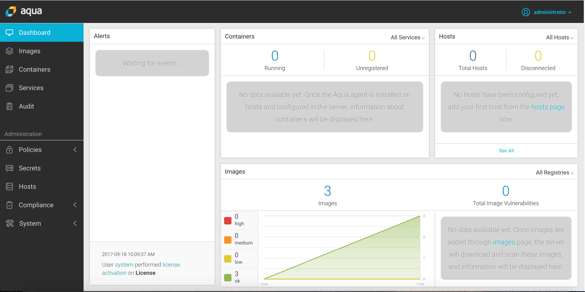

## Part 2: Vulnerability and risk assessment
1. From the Images menu, click Add Images to scan an image. Try the following:
   -	debian:jessie
   -	buildpack-deps:jessie
   -	node:latest
2.	Review results

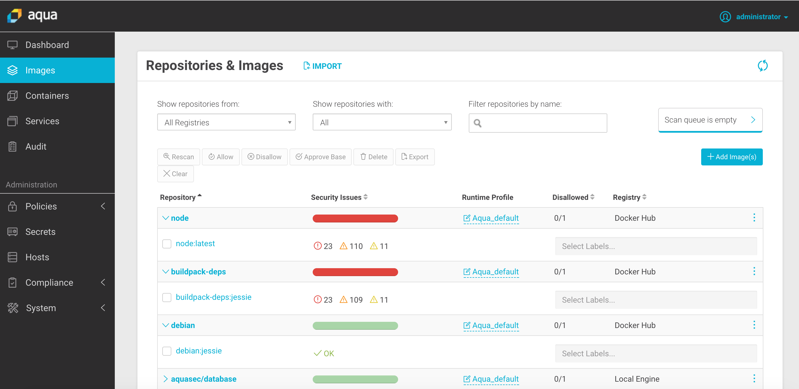
## Part 3: Integrate risk assessment into builds
1.  Review the script `build-mysql.sh`
2.	Build lab/mysql:1.0 image

```bash
./build-mysql.sh
```

Once the script completes, verify the image has been created by running `docker images`

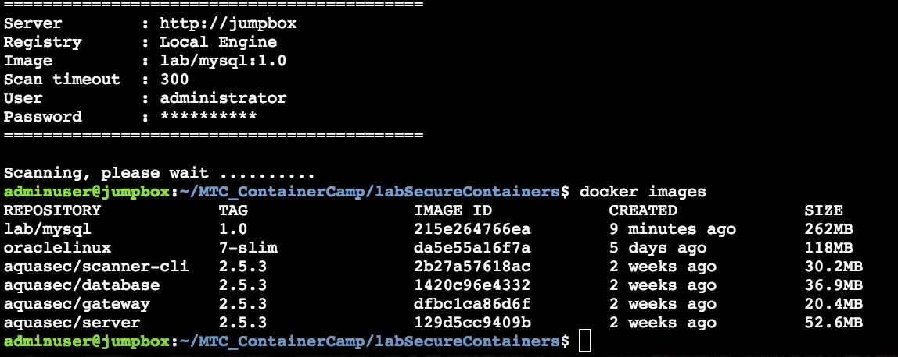

3.	Explore results in JSON file and in the UI

## Part 4: Enforcement on a Docker host
1.	Load the Aqua enforcement container using `agent-run.sh`

```bash
./agent-run.sh
```

2.	See the agent record in Aqua UI. Look at the images list.

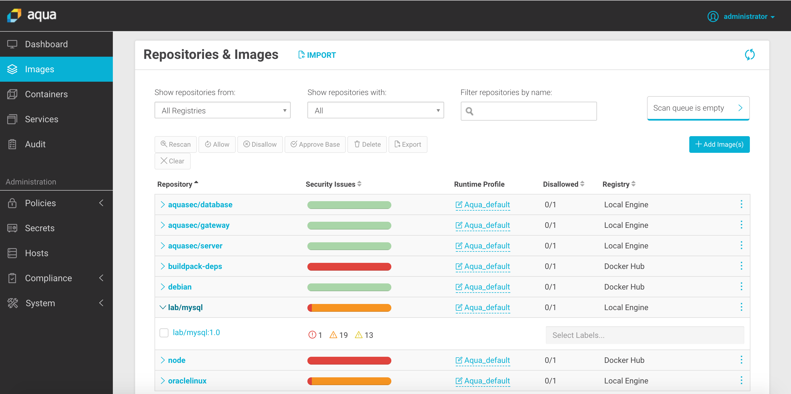

3.	In the Aqua UI, using Polcy -> Image Assurance, add a policy to Block Unregistered Images by clicking the plus button. Save your changes by cliking the "Save" button on the bottom of the page.

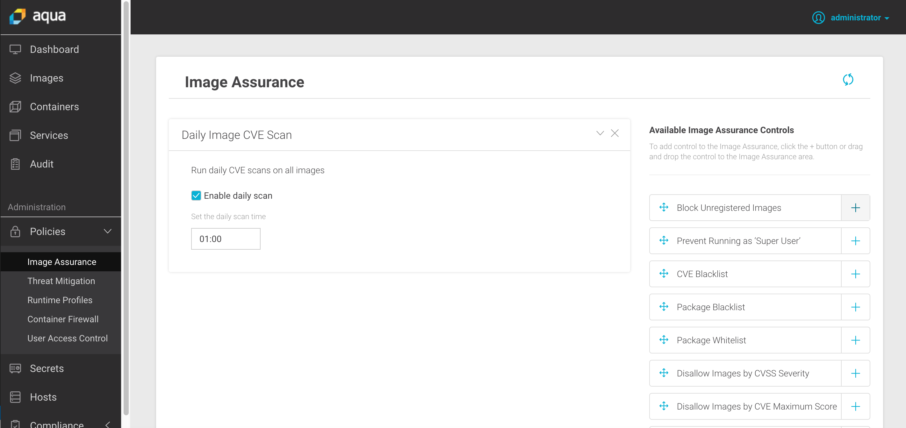

4.  Try to pull an unregistered image on the host, we will use Redis for this example.

```bash
docker run --rm -it redis:latest
```

If the policy to "Block Unregistered Images" has been enabled you should be prevented to pull or run the image:

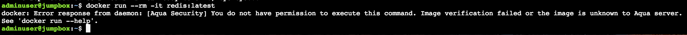

## Part 5: Run an application with security controls
1.	Run `load-images.sh`. It will fail until images are loaded and scanned (you can see the progress in the portal)

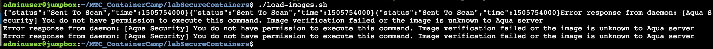

2.	In the meantime, review `read-compose.yml` and look for the database root password

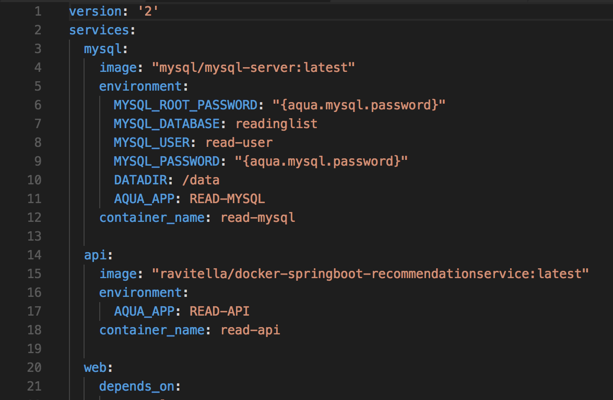

4.  Run `load-images.sh` to pull the images after they are registered

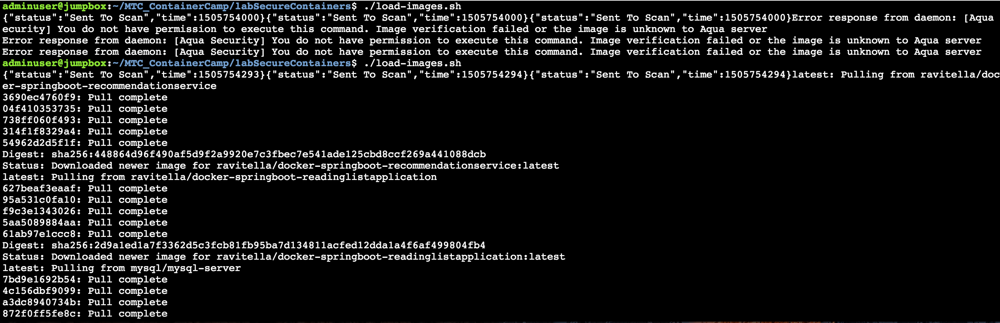

## Part 6: Secrets Management
1.	Define a secret in Aqua called mysql.password

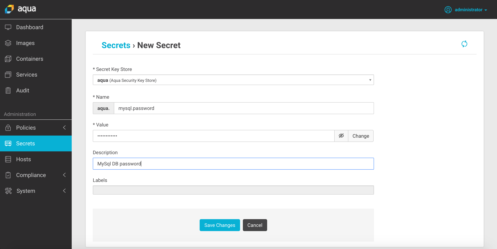

2.	Run `docker-compose -f read-compose.yml up -d mysql` and verify that it started

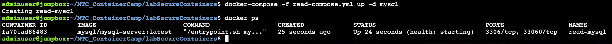

3.	After the container starts try connecting to the MySQL database

```bash
docker exec -it read-mysql mysql -p
```

4.	Type the secret password and then use \q to exit

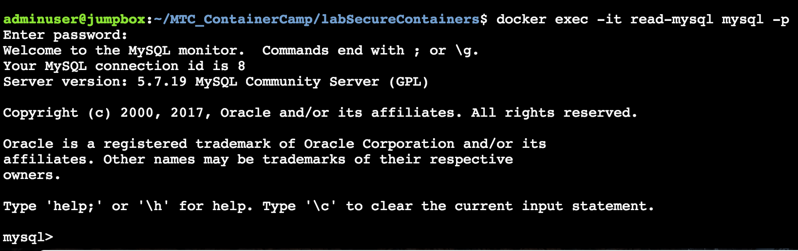

5.	Run `docker-compose -f read-compose.yml up -d`

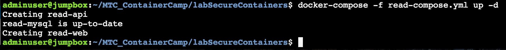

6.	Run `docker inspect read-web`

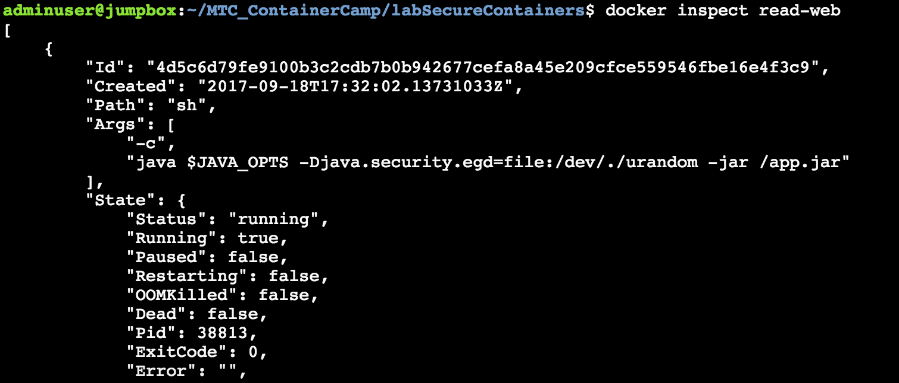

