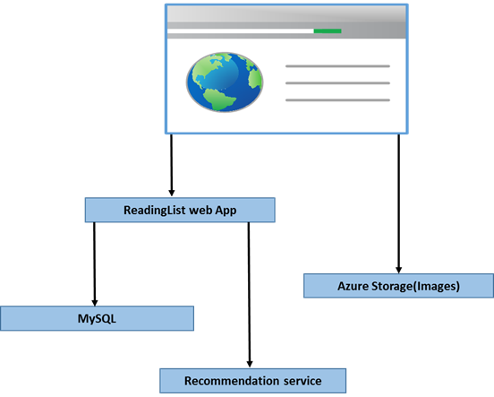

# Deploy multicontainer applications

In this lab we're going to experiment with using docker compose to deploy multi-container applications.

## Connect to the swarm master
First, ssh into your swarm master (using the instructions from part 1

## Docker Compose
For this lab, we're going to use a docker compose file to deploy a multi-container application on our cluster.  Copy the following, and save it to the file 'docker-compose.yml'

```
version: '3'
services:
  mysql:
    image: "mysql/mysql-server:latest"
    environment:
      MYSQL_ROOT_PASSWORD: password
      MYSQL_DATABASE: readinglist
      MYSQL_USER: user
      MYSQL_PASSWORD: password

  api:
    image: "ravitella/docker-springboot-recommendationservice:latest"

  web:
    depends_on:
      - mysql
      - api
    image: "ravitella/docker-springboot-readinglistapplication:latest"
    ports:
      - "80:7070"
    environment:
      spring.datasource.url: jdbc:mysql://mysql:3306/readinglist?useSSL=false
      spring.datasource.username: user
      spring.datasource.password: password
      externalAPI.recommendationAPIURL: http://api:8080/recommendations
   
```
You can create file using following command:


```
cat "[paste above docker compose file text]" >> docker-compose.yml
```

This file will be used to deploy a three-tier web application:




## Deploy the stack
We'll use the docker stack command to deploy the compose file:

    docker stack  deploy -c docker-compose.yml  READ

You can visit the app in your browser to try it out. Enter the url in your browser: http://[AGENTFQDN] 
<br>(this is the DNS name for the agend stack we noted in part 1)

### Analysis
To view the services in the stack:

    docker stack services READ

To vew the running components:

    docker stack ps READ

If you still have the Visualizer browser window open from Lab 4, take a look at how these services have deployed across your cluster.

## Scale a layer
First, note how the stack components translate to services:

    docker service ls

Now, let's scale the web tier:

    docker service scale READ_web=3
    docker service ls

Take a look at the Docker Visualizer window you opened in part 1.  Notice how the containers making up this application are deployed in the cluster.


